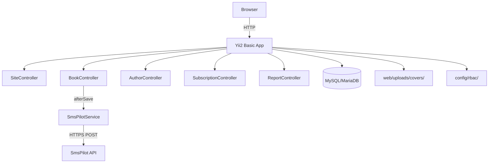
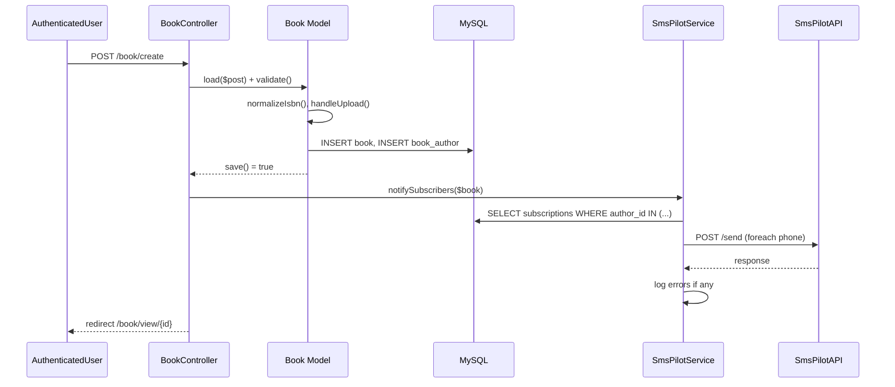

# Design Document — Book Catalog

## Overview

The Book Catalog is a Yii2 Basic application backed by MySQL/MariaDB. It exposes a public-facing catalog of books and authors, a guest subscription mechanism for SMS notifications, and an authenticated management interface for CRUD operations. SMS delivery is handled by the SmsPilot API (APIKEY=DEMO by default). Access control is enforced via Yii2 file-based RBAC.

### Key Design Decisions

- **Yii2 Basic (not Advanced)**: single-app structure; all code lives under the project root. No module system is used — controllers, models, and views follow Yii2 Basic conventions.
- **File-based RBAC**: roles and permissions are stored in `config/rbac/` PHP files, avoiding a DB dependency for authorization.
- **SmsPilot as a Yii2 component**: registered in `config/web.php` under `components`, injected via `Yii::$app->smsPilot`. This keeps the HTTP logic isolated and mockable.
- **ISBN normalization on save**: the `Book` model strips hyphens and spaces before persisting, ensuring the DB always holds canonical digit-only strings.
- **Idempotent subscriptions enforced at two layers**: a unique DB constraint on `(author_id, phone)` plus application-level `findOrCreate` logic.

---

## Architecture



### Request Flow — Book Creation with SMS



---

## Components and Interfaces

### Directory Structure

```
controllers/
  SiteController.php
  BookController.php
  AuthorController.php
  SubscriptionController.php
  ReportController.php
models/
  Book.php
  Author.php
  BookAuthor.php
  Subscription.php
  User.php          (existing, extended)
  BookSearch.php
  AuthorSearch.php
  ReportForm.php
  SubscriptionForm.php
components/
  SmsPilotService.php
views/
  book/
    index.php  create.php  update.php  view.php  _form.php
  author/
    index.php  create.php  update.php  view.php  _form.php
  report/
    index.php
  site/
    index.php  login.php  error.php
  layouts/
    main.php
config/
  rbac/
    items.php
    assignments.php
web/
  uploads/
    covers/       (writable, gitignored)
  css/
    site.css
```

### Controllers

#### SiteController
- `actionIndex` — public landing page
- `actionLogin` / `actionLogout` — authentication
- `actionError` — error handler

#### BookController
Access filter: `create`, `update`, `delete` require `manageBooks` permission.

- `actionIndex` — paginated book list (public)
- `actionView($id)` — book detail (public)
- `actionCreate` — form + save; triggers `SmsPilotService::notifySubscribers()` on success
- `actionUpdate($id)` — form + save
- `actionDelete($id)` — delete book, cascade join records, delete cover file

#### AuthorController
Access filter: `create`, `update`, `delete` require `manageAuthors` permission.

- `actionIndex` — paginated author list (public)
- `actionView($id)` — author detail with book list and subscription form (public)
- `actionCreate` — form + save
- `actionUpdate($id)` — form + save
- `actionDelete($id)` — delete author + cascade join records

#### SubscriptionController
- `actionCreate` — POST only; validates phone, idempotent upsert, redirects back to author page

#### ReportController
- `actionIndex` — GET/POST; renders year form; on valid submit runs top-10 query

### Components

#### SmsPilotService (`components/SmsPilotService.php`)

```php
class SmsPilotService extends Component
{
    public string $apiKey = 'DEMO';
    public string $sender = 'INFORM';

    // Sends SMS to all subscribers of the given book's authors.
    // Logs errors per-number; never throws.
    public function notifySubscribers(Book $book): void;

    // Builds the message string: "{title} — {authorName}"
    public function buildMessage(string $bookTitle, string $authorName): string;

    // Low-level HTTP call to SmsPilot JSON API.
    // Returns decoded response array or null on transport error.
    private function send(string $phone, string $message): ?array;
}
```

SmsPilot JSON endpoint: `https://smspilot.ru/api2.php`  
DEMO mode uses the same endpoint; the DEMO key causes the gateway to simulate delivery.

---

## Data Models

### Database Schema

```sql
-- book
CREATE TABLE book (
    id          INT UNSIGNED AUTO_INCREMENT PRIMARY KEY,
    title       VARCHAR(255) NOT NULL,
    year        SMALLINT UNSIGNED NOT NULL,
    description TEXT NULL,
    isbn        VARCHAR(13) NULL COMMENT 'canonical digits only, no hyphens',
    cover_path  VARCHAR(500) NULL,
    created_at  INT UNSIGNED NOT NULL,
    updated_at  INT UNSIGNED NOT NULL,
    INDEX idx_book_year (year)
) ENGINE=InnoDB DEFAULT CHARSET=utf8mb4;

-- author
CREATE TABLE author (
    id         INT UNSIGNED AUTO_INCREMENT PRIMARY KEY,
    full_name  VARCHAR(255) NOT NULL,
    created_at INT UNSIGNED NOT NULL,
    updated_at INT UNSIGNED NOT NULL
) ENGINE=InnoDB DEFAULT CHARSET=utf8mb4;

-- book_author (join table)
CREATE TABLE book_author (
    book_id   INT UNSIGNED NOT NULL,
    author_id INT UNSIGNED NOT NULL,
    PRIMARY KEY (book_id, author_id),
    FOREIGN KEY (book_id)   REFERENCES book(id)   ON DELETE CASCADE,
    FOREIGN KEY (author_id) REFERENCES author(id) ON DELETE CASCADE
) ENGINE=InnoDB DEFAULT CHARSET=utf8mb4;

-- subscription
CREATE TABLE subscription (
    id         INT UNSIGNED AUTO_INCREMENT PRIMARY KEY,
    author_id  INT UNSIGNED NOT NULL,
    phone      VARCHAR(16) NOT NULL,
    created_at INT UNSIGNED NOT NULL,
    UNIQUE KEY uq_subscription (author_id, phone),
    FOREIGN KEY (author_id) REFERENCES author(id) ON DELETE CASCADE
) ENGINE=InnoDB DEFAULT CHARSET=utf8mb4;

-- user (Yii2 Basic default, extended)
CREATE TABLE user (
    id            INT UNSIGNED AUTO_INCREMENT PRIMARY KEY,
    username      VARCHAR(255) NOT NULL UNIQUE,
    password_hash VARCHAR(255) NOT NULL,
    auth_key      VARCHAR(32)  NOT NULL,
    status        SMALLINT NOT NULL DEFAULT 10,
    created_at    INT UNSIGNED NOT NULL,
    updated_at    INT UNSIGNED NOT NULL
) ENGINE=InnoDB DEFAULT CHARSET=utf8mb4;
```

### ActiveRecord Models

#### Book
- `rules()`: `title` required string; `year` required integer; `isbn` optional, custom `IsbnValidator`; `cover_path` safe; `description` safe
- `beforeSave()`: normalize ISBN (strip hyphens/spaces), handle `UploadedFile` → save to `web/uploads/covers/{md5}.{ext}`, set `cover_path`
- `afterDelete()`: unlink cover file if set
- `getAuthors()`: `hasMany(Author::class)->viaTable('book_author', ['book_id'=>'id'])`
- `getBookAuthors()`: `hasMany(BookAuthor::class, ['book_id'=>'id'])`

#### Author
- `rules()`: `full_name` required string max 255
- `getBooks()`: `hasMany(Book::class)->viaTable('book_author', ['author_id'=>'id'])`
- `getSubscriptions()`: `hasMany(Subscription::class, ['author_id'=>'id'])`

#### BookAuthor
- Columns: `book_id`, `author_id`
- No extra rules beyond FK constraints

#### Subscription
- `rules()`: `author_id` required integer; `phone` required, matches `/^\+?\d{10,15}$/`
- `findOrCreate(int $authorId, string $phone)`: static method — attempts insert, catches unique constraint violation, returns model

#### IsbnValidator (custom validator, `components/IsbnValidator.php`)
- Extends `yii\validators\Validator`
- `validateValue($value)`: strip hyphens/spaces → check length (10 or 13) → run check-digit algorithm → return error message or null

### RBAC Setup (`config/rbac/`)

```
items.php:
  permissions: manageBooks, manageAuthors
  roles: guest (no permissions), user (manageBooks + manageAuthors)

assignments.php:
  user ID 1 → role "user"   (seeded admin)
```

`config/web.php` authManager component:
```php
'authManager' => [
    'class' => 'yii\rbac\PhpManager',
    'itemFile'       => '@app/config/rbac/items.php',
    'assignmentFile' => '@app/config/rbac/assignments.php',
    'ruleFile'       => '@app/config/rbac/rules.php',
],
```

Controllers use `AccessControl` behavior:
```php
public function behaviors(): array {
    return [
        'access' => [
            'class' => AccessControl::class,
            'rules' => [
                ['allow' => true, 'actions' => ['index','view'], 'roles' => ['?','@']],
                ['allow' => true, 'actions' => ['create','update','delete'], 'roles' => ['manageBooks']],
            ],
        ],
    ];
}
```

### SmsPilotService Registration

```php
// config/web.php
'components' => [
    'smsPilot' => [
        'class' => 'app\components\SmsPilotService',
        'apiKey' => YII_ENV_PROD ? getenv('SMSPILOT_KEY') : 'DEMO',
    ],
],
```

### Report Query

```php
// ReportController::actionIndex
$rows = (new Query())
    ->select(['a.full_name', 'COUNT(ba.book_id) AS book_count'])
    ->from(['a' => 'author'])
    ->innerJoin(['ba' => 'book_author'], 'ba.author_id = a.id')
    ->innerJoin(['b' => 'book'], 'b.id = ba.book_id AND b.year = :year', [':year' => $year])
    ->groupBy('a.id')
    ->orderBy(['book_count' => SORT_DESC, 'a.full_name' => SORT_ASC])
    ->limit(10)
    ->all();
```

### UI Design System

Custom stylesheet at `web/css/site.css` replaces the default Bootstrap theme.

Color palette:
- Primary: `#2C3E50` (dark navy)
- Accent: `#E74C3C` (red)
- Background: `#F8F9FA` (light grey)
- Surface: `#FFFFFF`
- Text: `#2C3E50`

Typography: `Inter` (Google Fonts), fallback `system-ui, sans-serif`. Base 16px, headings scale 1.25×.

Components:
- `.card` — white surface, `border-radius: 8px`, `box-shadow: 0 2px 8px rgba(0,0,0,.08)`
- `.cover-thumb` — `80×120px` object-fit cover, grey placeholder background
- `.alert-success` / `.alert-danger` — colored left-border flash messages
- `.btn-primary` — accent red background, white text
- Responsive grid: CSS Grid, 3 columns ≥ 992px, 2 columns ≥ 576px, 1 column below


---

## Correctness Properties

*A property is a characteristic or behavior that should hold true across all valid executions of a system — essentially, a formal statement about what the system should do. Properties serve as the bridge between human-readable specifications and machine-verifiable correctness guarantees.*

### Property 1: ISBN Round-Trip Normalization

*For any* valid ISBN-10 or ISBN-13 string (with or without hyphens or spaces), parsing it through `IsbnValidator::normalize()` and then re-normalizing the result should produce the same canonical digit-only string, and the check-digit validation should pass.

**Validates: Requirements 10.1, 10.2, 10.3, 10.4**

### Property 2: ISBN Rejection of Invalid Check Digits

*For any* digit string of length 10 or 13 whose check digit has been deliberately corrupted, `IsbnValidator` should reject it with a validation error.

**Validates: Requirements 1.4, 10.5**

### Property 3: Book Persistence Round-Trip

*For any* valid set of book attributes (title, year, optional description, optional normalized ISBN), saving a `Book` model and then reloading it from the database should yield a record with identical field values.

**Validates: Requirements 1.1, 1.2, 1.8**

### Property 4: Required-Field Validation Rejection

*For any* `Book` model missing `title` or `year`, and *for any* `Author` model missing `full_name`, calling `validate()` should return `false` and `getErrors()` should contain an entry for the missing field.

**Validates: Requirements 1.3, 2.3**

### Property 5: Delete Cascades Join Records

*For any* book that has one or more authors assigned (rows in `book_author`), deleting that book should result in zero `book_author` rows for that `book_id`. Symmetrically, deleting an author should result in zero `book_author` rows for that `author_id`.

**Validates: Requirements 1.7, 2.4**

### Property 6: Idempotent Subscription

*For any* `(author_id, phone)` pair, calling the subscription creation endpoint or `Subscription::findOrCreate()` two or more times should result in exactly one row in the `subscription` table for that pair.

**Validates: Requirements 5.5, 8.5**

### Property 7: Phone Number Validation

*For any* string that does not match `/^\+?\d{10,15}$/`, the `Subscription` model's `validate()` should return `false`. *For any* string that does match, it should return `true`.

**Validates: Requirements 5.3, 5.4**

### Property 8: SMS Message Content

*For any* book title and author full name, `SmsPilotService::buildMessage()` should return a string that contains both the book title and the author's full name as substrings.

**Validates: Requirements 6.6**

### Property 9: SMS Recipient Collection

*For any* newly created book associated with N authors, each having M_i subscribers, `SmsPilotService::notifySubscribers()` should attempt to send exactly Σ M_i SMS messages (one per unique subscriber phone number across all authors).

**Validates: Requirements 6.1, 6.2, 6.3**

### Property 10: Report Ordering

*For any* dataset of books and authors for a given year, the report query should return at most 10 rows, ordered by `book_count DESC`, with ties broken by `full_name ASC`.

**Validates: Requirements 7.3, 7.4**

### Property 11: Report Validation Rejection

*For any* non-integer or out-of-range year value submitted to `ReportForm`, `validate()` should return `false`.

**Validates: Requirements 7.6**

### Property 12: Cover Image Path Persistence

*For any* valid image file uploaded with a book, after `save()` the `Book` model's `cover_path` should be a non-empty string pointing to a file that exists under `web/uploads/covers/`.

**Validates: Requirements 1.5**

### Property 13: Non-Image Upload Rejection

*For any* file whose MIME type is not in the allowed image types (`image/jpeg`, `image/png`, `image/gif`, `image/webp`), the `Book` model's `validate()` should return `false` with an error on the cover image field.

**Validates: Requirements 1.6**

### Property 14: Access Control Redirect

*For any* controller action annotated with `manageBooks` or `manageAuthors` permission, an unauthenticated request should result in a redirect to the login page (HTTP 302), not a 200 or 403.

**Validates: Requirements 4.2**

---

## Error Handling

### Validation Errors
All models use Yii2's built-in validation pipeline. Controllers call `$model->validate()` before `$model->save(false)`. Views render `$form->errorSummary($model)` and per-field `$form->error($model, 'field')`.

### File Upload Errors
`UploadedFile::getInstance()` returns `null` if no file is uploaded — the `beforeSave` hook checks for null before processing. MIME validation is handled by `FileValidator` in `Book::rules()`. If the filesystem write fails, `save()` returns false and the error is added to the model.

### SMS Errors
`SmsPilotService::send()` wraps the HTTP call in a try/catch. On any exception or non-success API response, it calls `Yii::error($message, 'smspilot')` and returns `null`. The `notifySubscribers()` loop continues to the next subscriber. Book creation is never rolled back due to SMS failure.

### Database Errors
Unique constraint violations on `subscription(author_id, phone)` are caught in `Subscription::findOrCreate()` and treated as a successful no-op (idempotent). Other DB exceptions propagate and are caught by Yii2's error handler, rendering the error page.

### RBAC / Access Denied
Yii2's `AccessControl` behavior throws `ForbiddenHttpException` for authenticated users without the required permission, and redirects guests to the login URL via `loginRequired()`.

---

## Testing Strategy

### Dual Testing Approach

Both unit tests and property-based tests are required. Unit tests cover specific examples, integration points, and edge cases. Property-based tests verify universal correctness across randomized inputs.

### Unit Tests (PHPUnit via Codeception)

Located in `tests/unit/`. Focus areas:

- `IsbnValidatorTest`: specific valid/invalid ISBN-10 and ISBN-13 examples, including edge cases (all-zeros, max values)
- `SubscriptionTest`: `findOrCreate` with duplicate insert, phone regex boundary values
- `SmsPilotServiceTest`: `buildMessage` output, `notifySubscribers` with mocked HTTP client
- `ReportQueryTest`: SQL query result shape with a seeded in-memory SQLite or test DB fixture
- `BookTest`: `beforeSave` normalization, cover path assignment, cascade delete via `afterDelete`

### Property-Based Tests

Use **[eris/eris](https://github.com/giorgiosironi/eris)** (PHP property-based testing library) integrated with PHPUnit/Codeception.

Each property test runs a minimum of **100 iterations**.

Each test is tagged with a comment in the format:
`// Feature: book-catalog, Property {N}: {property_text}`

| Property | Test Class | Generator Strategy |
|---|---|---|
| P1: ISBN Round-Trip | `IsbnRoundTripTest` | Generate valid ISBN-10/13 strings with random hyphens inserted |
| P2: ISBN Invalid Check Digit | `IsbnInvalidCheckTest` | Generate valid ISBNs, corrupt last digit |
| P3: Book Persistence Round-Trip | `BookPersistenceTest` | Generate random title (string), year (1000–2100), optional description |
| P4: Required-Field Rejection | `ModelValidationTest` | Generate Book with null title or year; Author with empty name |
| P5: Delete Cascade | `DeleteCascadeTest` | Generate book with 1–5 random authors, delete, assert join table empty |
| P6: Idempotent Subscription | `SubscriptionIdempotencyTest` | Generate random phone+author_id, call findOrCreate 2–5 times |
| P7: Phone Validation | `PhoneValidationTest` | Generate strings matching and not matching the phone regex |
| P8: SMS Message Content | `SmsMessageTest` | Generate random book title and author name strings |
| P9: SMS Recipient Collection | `SmsRecipientTest` | Generate book with N authors each with M subscribers, assert send count |
| P10: Report Ordering | `ReportOrderingTest` | Generate random author/book/year dataset, assert result ordering |
| P11: Report Year Validation | `ReportFormValidationTest` | Generate non-integer and out-of-range year values |
| P12: Cover Path Persistence | `CoverPathTest` | Generate valid image file mocks, assert path non-empty and file exists |
| P13: Non-Image Rejection | `NonImageUploadTest` | Generate files with non-image MIME types |
| P14: Access Control Redirect | `AccessControlTest` | For each protected action, assert unauthenticated request → 302 to login |

### Test Configuration

```yaml
# tests/unit.suite.yml (relevant excerpt)
modules:
  enabled:
    - Yii2:
        configFile: config/test.php
    - \Helper\Unit
```

Property tests live in `tests/unit/properties/` and extend `PHPUnit\Framework\TestCase` with the Eris `\Eris\TestTrait`.

Example skeleton:

```php
// Feature: book-catalog, Property 1: ISBN Round-Trip Normalization
class IsbnRoundTripTest extends TestCase
{
    use \Eris\TestTrait;

    public function testIsbnRoundTrip(): void
    {
        $this->forAll(
            Generator\elements(...$this->validIsbnSamples())
        )
        ->withMaxSize(200)
        ->then(function (string $isbn) {
            $normalized = IsbnValidator::normalize($isbn);
            $this->assertMatchesRegularExpression('/^\d{10}$|^\d{13}$/', $normalized);
            $this->assertTrue(IsbnValidator::isValid($normalized));
        });
    }
}
```
